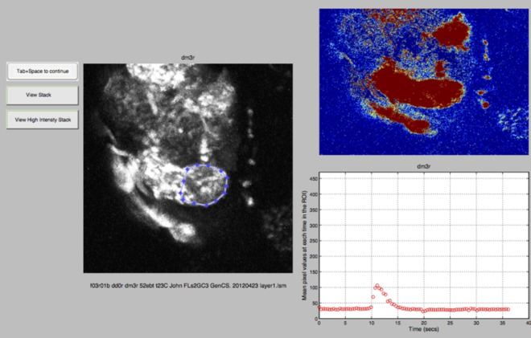
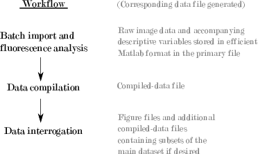
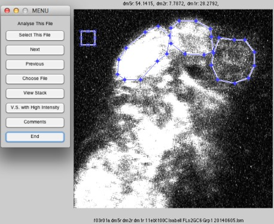
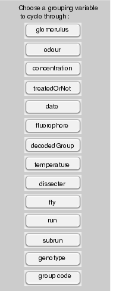

# Analysis pipeline in Matlab for live-imaging.

An early version of this code was used for the analysis in the publications listed below [1,2]. It provides:
*   a convenient workflow to turn image files containing fluorescence time-series, generated from live imaging experiments in  biology, into systematically processed data.
* an intuitive user-interface to assess the data according to many descriptive variables with output formats including graphs and statistical tables.

## Basic workflow
+ Place all the image files for analysis (currently works with the .lsm image file format) into a single directory.
+ Run the `SelectROIs` function. When this function is run for the first time in a directory it converts the image files into .mat files in which the image data and associated metadata are subsequently stored. With user-interaction, this function also saves each region of interest (ROI) for each of the time-series files.
+ When all ROIs are saved, run the `ConsolidateMatFiles` function to consolidate the data into a single compiled data file.
+ Finally the `FurtherAnalysis` function uses this compiled data file to generate graphs and statistics in an interactive manner. 

##### The SelectROIs function

Using a GUI, the user navigates through the time-series in the directory and selects the ones to be used for analysis.
A heatmap indicates regions that displayed an increase in fluorescence over the course of the time series.
Upon selection the user is provided with a means to input ROI names, select a background region of the image (in case subsequent background subtraction is desired), select each ROI and finally add any comments specific to that file. 
Upon subsequent selection of an edited file the user may edit the previously defined metadata or erase it and start again.

##### The ConsolidateMatFiles function
Running this function compiles the .mat files containing all image data into a final file containing only the mean fluorescence intensity at each time point for each ROI and the metadata associated with each file. The file is greatly reduced in size and can be used for all subsequent analysis.

##### The FurtherAnalysis function

The user is presented with a number of descriptive/categorical variables to use in the analysis of the compiled data file (an example file is saved in the data directory in this repository). Graph and statistical output can be generated as required (see /private/CycleThroughUserDefinedGroupsForPlotting).

## Automatic metadata generation (input file nomenclature)
Metadata for each time-series is extracted from the file name. This necessitates naming the original image file in a systematic way to fully avail of this feature. Features can be left blank if not required. An example of a file name is: 'f03r02a dm5r dm2r dm1rs 52ebt t25C 15minsExposed John Grp3 2012\05\24.lsm'

This filename can be broken down into the following tokens for extraction:

* image series id: a unique code for each time-series file on a given date - e.g: 'f01r01a'. This was defined by the fly (denoted by f and a 2-digit number ), each run (denoted by r and a 2-digit number)  and each sub-run (denoted by a letter) allowing complexity to the structure of the experiment. This structure can be interpretted as : individual samples, trains of image-series files, individual time-series files within each train. 
* glomerulus - e.g: 'dm2'. Each active glomerulus for the time-series was denoted by two lower case letters followed by a number. While this software can be used to study any region of interest in an image time series, the format for automated ROI name extraction follows the format Letter-Letter-Digit.
* odour stimulus - e.g: '10ebt'. This is defined as a 2-digit number representing concentration and a 3-letter user-defined tag for each odourant.
* temperature - e.g: 't25C'. The temperature of the perfusion saline can be recorded and entered as a 't' and a 'C' surrounding a 2-digit number.
* treatment - e.g: '15minsExposure'. A user-defined tag (defined upon data file compilation) is be detected in filenames to discern whether any given time-series has undergone the treatment condition. Files in a directory without this tag were defined as not treated.
* group - e.g: 'Grp1'. For blinding the experiments each genotype or treatment can be assigned a group number each day. Upon compilation these group numbers can be decoded so that the appropriate label is assigned to each file.
* Date - e.g: '2012\11\28'. A 6-digit number, with or without a separator, in the format YYYY MM DD.
    
## Installation
1. Download or clone this repository to a directory on the Matlab search path.

2. Run the functions in the order described above (or as listed in demo_function.m). 

I have attempted to include all dependencies, with the associated licences, in the third party functions directory. Some parts of the analysis suite use Matlab toolboxes though. If you have any problems create an issue in the Github repository and I'll do my best. Thanks! 

#### Bibliography
1. Das, S., Sadanandappa, M. K., Dervan, A., larkin, A., Lee, J. A., Sudhakaran, I. P., Priya, R., Heidari, R., Holohan, E. E., Pimentel, A., Gandhi, A., Ito, K., Sanyal, S., Wang, J. W., Rodrigues, V. and Ramaswami, M. (2011) ‘Plasticity of local GABAergic interneurons drives olfactory habituation.’, Proceedings of the National Academy of Sciences, 108(36), pp. E646–E654. doi: 10.1073/pnas.1106411108.
2. McCann, C., Holohan, E. E., Das, S., Dervan, A., larkin, A., Lee, J. A., Rodrigues, V., Parker, R. and Ramaswami, M. (2011) ‘The Ataxin-2 protein is required for microRNA function and synapse-specific long-term olfactory habituation.’, Proceedings of the National Academy of Sciences, 108(36), pp. E655–62. doi: 10.1073/pnas.1107198108.
